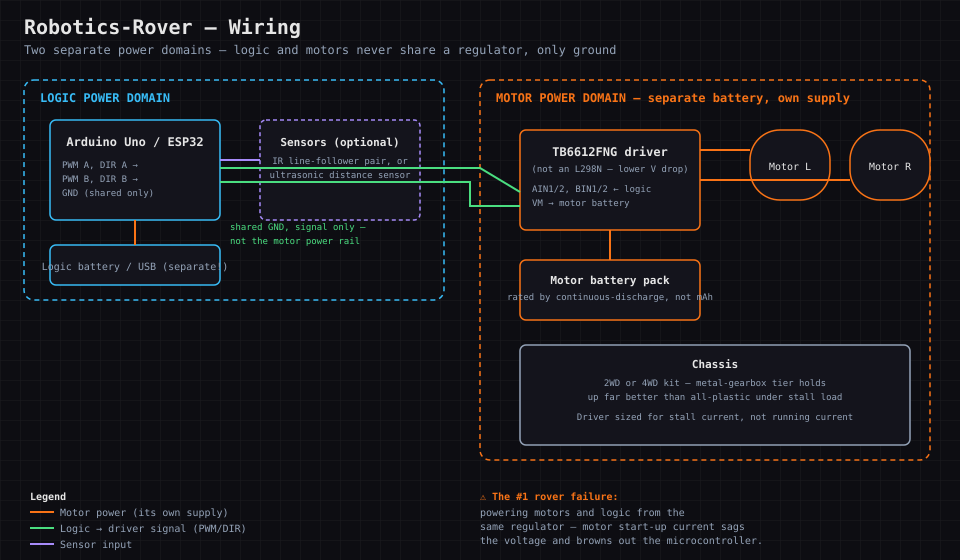

# Robotics-Rover

### A small wheeled rover with motor control — the one Chain K skill nothing else here touches: driving motors, not just reading sensors.

  

[📖 Lesson Plan](docs/LESSON_PLAN.md)

<!-- SCREENSHOT PLACEHOLDER: docs/screenshots/overview.png -->

> ⬜ **Scaffold pending.** Directory created to portfolio standard; full content to be built. Real-hardware build with an emulation/planning-first path. Part of **Chain K — Hardware & Systems Foundations**.

## Why This Was Built

Every other build in this chain reads the world (sensors, radio) or displays to it (screens). A rover
*acts* on it — and motors are a genuinely different problem: they draw far more current than logic
circuits, need their own driver stage so a microcontroller pin doesn't fry, and closing a feedback loop
(line-following, obstacle avoidance) is a different kind of programming than reading a sensor value.

## Hardware Buying Guide (What to look for & red flags)

**Parts list:** a 2WD or 4WD chassis kit (comes with motors, wheels, and a mounting plate), a motor driver
board (an L298N or, better, a TB6612FNG — lower voltage drop, runs cooler), a microcontroller (Arduino Uno
or ESP32), a separate battery pack for the motors (never power motors off the same regulator as your logic
board — see failure points), and optionally line-following IR sensors or an ultrasonic distance sensor for
autonomous behavior.

**What to look for:** a driver board rated well above your motors' stall current (motors draw far more
current stalled than running free — size for stall, not typical draw). A chassis with metal gearboxes
holds up better than all-plastic ones.

**Red flags:** "motor driver" listings with no current rating specified at all, and battery packs with no
continuous-discharge rating (the number that actually matters for motors, not just capacity in mAh).

**Common failure points:** powering motors and logic from the same battery/regulator — motor start-up
current sags the voltage and brownouts the microcontroller — always separate them and share only ground;
undersized wire gauge to the motors causing voltage drop; and a driver board with no flyback diodes letting
motor back-EMF damage the driver (most breakout boards include these, but bare H-bridge ICs may not).

## Wiring Diagram

**Two separate power domains, one shared ground.** The microcontroller and sensors live on their own logic
supply; the driver's motor-side terminals get their own separate battery — the two rails only ever meet at
ground, never at power. This single decision prevents the #1 rover failure (motor start-up current
brownout-ing the microcontroller):

## Parts & Pricing

Pulled from the chain-wide [Hardware Shopping List](../HARDWARE_SHOPPING_LIST.md#robotics-rover) — check
there for current links; prices drift. **Budget/Mid/Luxury are the same tiers the shopping list calls
Budget/Mid/Premium.**

| Item | Budget | Mid | Luxury |
|---|---|---|---|
| Chassis + motors | Generic 2WD TT-motor kit, ~$12–18 | 4WD version, ~$20–25 | Metal-gearbox chassis kit, ~$35–45 — holds up far better over time |
| Motor driver | [SparkFun TB6612FNG breakout, ~$8](https://www.amazon.com/SparkFun-Motor-Driver-TB6612FNG-Headers/dp/B07PV1S8HX) | Same board — already the right pick over an L298N at every tier | — |
| Microcontroller | Arduino Uno (~$20–25) | ESP32 (~$8–12) — adds wireless control | Same |
| Sensors | Basic IR line-follower pair, ~$5–8 | + ultrasonic distance sensor, ~$3–5 | Combined IR + ultrasonic sensor array board, ~$15–20 |
| Motor battery | Any pack with a stated continuous-discharge rating | Same, sized above your motors' stall current | A dedicated RC-hobby LiPo pack — better sustained current under load |

Running total: **~$45–55 budget → ~$85–100 luxury**, not counting the microcontroller you likely already
have from another Chain K project. Motor battery is priced separately from — and must stay separate from —
whatever powers the logic side.

## Why This Matters (Industry Application)

Motor control, current budgeting, and closed-loop control are core to robotics and embedded systems roles
— a meaningfully different (and in-demand) skill set from the sensor/radio/display focus of the rest of
this chain.

## Topics Covered

| Area | What this project covers |
|------|--------------------------|
| Motor control | H-bridges, PWM speed control, driver ICs |
| Power isolation | Why motors need their own supply, separate from logic |
| Chassis | Mechanical assembly and wheel/gearbox tradeoffs |
| Sensing | Line-following or ultrasonic obstacle avoidance |
| Control loops | Reading a sensor and acting on it in real time |
| Debugging | Diagnosing brownouts and driver failures |

## How This Connects

Chain K (Hardware & Systems Foundations). Uses breadboarding/soldering from **Electronics-Circuits-Bench**;
a natural pairing with **3D-Printer-Build** for a custom chassis or sensor mounts.

---
Dual licensed — [GPL v3](LICENSE-GPL) and [AGPL v3](LICENSE-AGPL).
